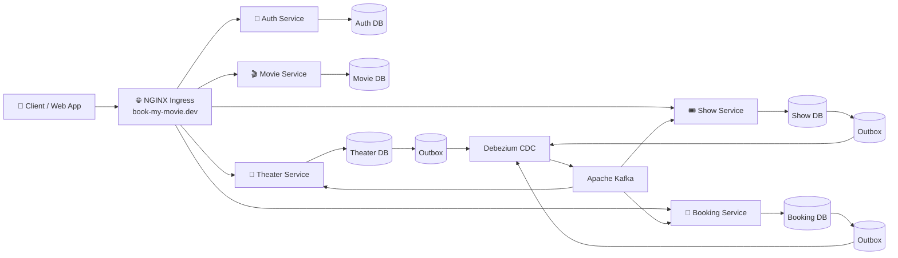
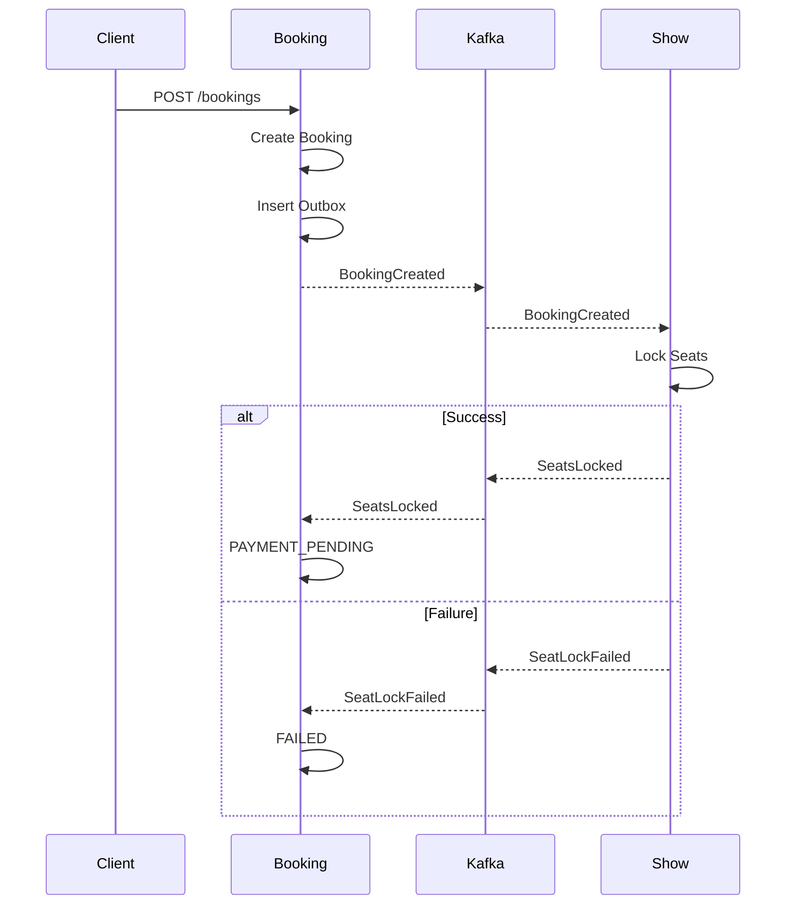

# BookMyMovie - Kubernetes Infrastructure

Production-oriented Kubernetes deployment for an event-driven movie ticket booking platform.

---

# High-Level Architecture



---

# Event Flow



---

# Kubernetes Components

| Component       | Description                        |
| --------------- | ---------------------------------- |
| NGINX Ingress   | External entry point               |
| Auth Service    | Authentication & RBAC              |
| Movie Service   | Movie Catalog                      |
| Theater Service | Theater / Screen / Seat Management |
| Show Service    | Show Scheduling & Seat Inventory   |
| Booking Service | Booking Aggregate & Saga           |
| PostgreSQL      | Dedicated database per service     |
| Debezium        | Change Data Capture                |
| Apache Kafka    | Event Bus                          |
| Strimzi         | Kafka Operator                     |

---

# Database Ownership

Each service owns its own PostgreSQL database.

```
Auth
 └── auth-db

Movie
 └── movie-db

Theater
 └── theater-db

Show
 └── show-db

Booking
 └── booking-db
```

No service directly queries another service's database.

---

# Communication

## Synchronous

REST APIs

```
Client

↓

Ingress

↓

Microservice
```

Used for:

- Authentication
- Movie APIs
- Theater APIs
- Show APIs
- Booking APIs

---

## Asynchronous

Kafka Events

```
Service

↓

Outbox

↓

PostgreSQL WAL

↓

Debezium

↓

Kafka

↓

Consumer

↓

Projection
```

Used for:

- Projection updates
- Booking Saga
- Seat synchronization
- Cross-service communication

---

# Current Event Flow

Implemented:

```
Theater

↓

ScreenCreated

↓

Show Projection
```

```
Theater

↓

SeatCreated

↓

Show Projection
```

```
Theater

↓

ScreenUpdated

↓

Show Projection
```

```
Theater

↓

SeatDeleted

↓

Show Projection
```

```
Booking

↓

BookingCreated

↓

Show

↓

Seat Lock (In Progress)
```

---

# Shared Library

```
@adarsh-tickets/shared
```

Contains:

- JWT Authentication
- RBAC
- Common Errors
- Kafka Producer Manager
- Kafka Consumer Manager
- Event Contracts
- Avro Serialization
- Schema Registry
- Dead Letter Publisher
- Kafka Configuration
- Middleware
- Utility Functions

---

# Reliability Patterns

Implemented:

- Transactional Outbox Pattern
- Debezium Change Data Capture
- Apache Kafka
- Apache Avro Serialization
- Schema Registry
- Dead Letter Topics
- Idempotent Kafka Producer
- Consumer Abstraction
- CQRS Read Projections
- Optimistic Concurrency Control

In Progress:

- Orchestrated Saga
- Seat Locking
- Booking Compensation
- Payment Workflow
- Pessimistic Locking for Seat Reservation

---

# Local Development

```
skaffold dev
```

Skaffold automatically:

- Builds Docker images
- Deploys Kubernetes resources
- Watches file changes
- Syncs code into running containers
- Restarts affected services
