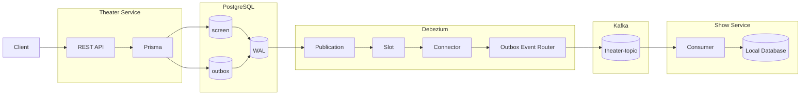

# BookMyMovie

A scalable movie ticket booking platform inspired by BookMyShow, built using Node.js, TypeScript, PostgreSQL, Prisma, Kubernetes, and event-driven architecture.

## Overview

BookMyMovie allows users to browse movies, discover theaters, view show timings, reserve seats, and book tickets. The project is designed to demonstrate modern backend engineering concepts including microservices, distributed systems, role-based access control (RBAC), event-driven communication, and Saga orchestration.

## Infrastructure diagram

https://miro.com/app/board/uXjVHDx8I3A=/?share_link_id=878606900324

## Features

### Authentication & Authorization

- User registration and login
- JWT-based authentication
- Role-Based Access Control (RBAC)
- Predefined roles:
  - ADMIN
  - THEATER_OWNER
  - USER

- Permission-based route authorization

### Movie Management

- Movie catalog management
- Poster and trailer support
- Bulk movie import support
- Search and filtering capabilities

### Theater Management

- Theater creation and management
- Screen management
- Seat layout configuration
- Theater owner onboarding

### Show Management

- Show scheduling
- Screen allocation
- Show seat generation
- Seat availability tracking

### Booking System

- Seat reservation
- Booking confirmation
- Booking cancellation
- Booking history

### Distributed Systems Concepts

- Event-driven communication using NATS
- Service-to-service messaging
- Event sourcing patterns
- Saga orchestration for booking workflows
- Compensation handling for payment failures

### AI Incident Summarizer (Planned)

- Consumes distributed system events
- Generates human-readable incident summaries
- Assists in operational monitoring and debugging
- Demonstrates practical GenAI integration in backend systems

## Technology Stack

### Backend

- Node.js
- TypeScript
- Express.js

### Database

- PostgreSQL
- Prisma ORM

### Infrastructure

- Docker
- Kubernetes
- Skaffold
- NGINX Ingress

### Messaging

- NATS

### Authentication

- JWT
- RBAC

### AI (Planned)

- LangChain
- LLM-based Incident Analysis

## Architecture

Services are designed around business capabilities:

- Auth Service
- Movie Service
- Theater Service
- Booking Service

Shared utilities are published as a reusable npm package:

@adarsh-tickets/shared

## Goals

This project focuses on learning and demonstrating:

- Microservice Architecture
- Distributed Systems
- Event-Driven Design
- Saga Pattern
- Kubernetes Deployment
- High-Level System Design
- Production-Oriented Backend Development
